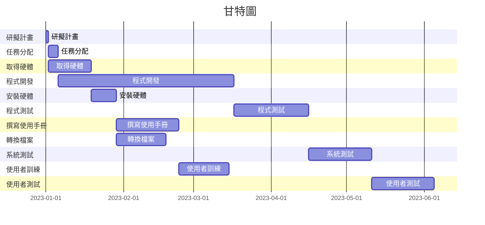
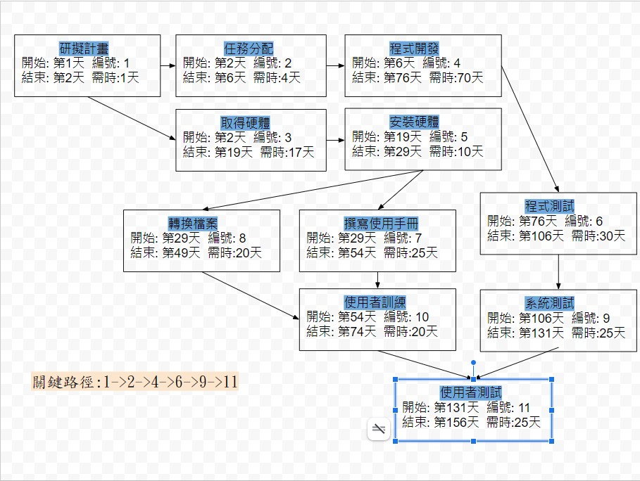

# 專案管理

## 甘特圖

```mermaid
gantt
    title 甘特圖

    section 研擬計畫
    研擬計畫      :a1, 2023-01-01, 1d
    section 任務分配
    任務分配      :a2,after a1  , 4d
    section 取得硬體
    取得硬體      :a3,after a1  , 17d
    section 程式開發
    程式開發      :a4,after a2  , 70d
    section 安裝硬體
    安裝硬體      :a5,after a3  , 10d
    section 程式測試
    程式測試      :a6,after a4  , 30d
    section 撰寫使用手冊
    撰寫使用手冊  :a7,after a5  , 25d
    section 轉換檔案
    轉換檔案      :a8,after a5  , 20d
    section 系統測試
    系統測試      :a9,after a6  , 25d
    section 使用者訓練
    使用者訓練    :a10,after a7 , 20d
    section 使用者測試
    使用者測試    :a11,after a9 , 25d

```

## PERT/CPM 圖

## 關鍵路徑
關鍵路徑:1->2->4->6->9->11
